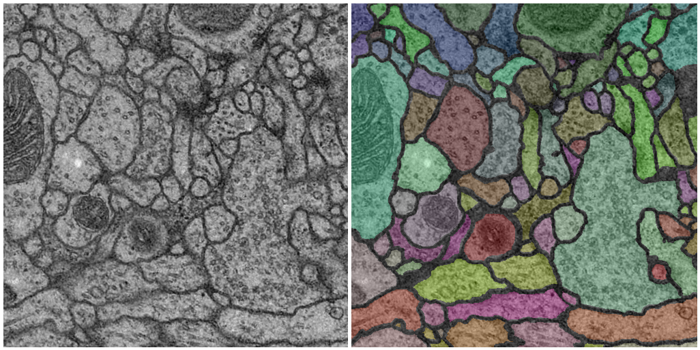

# U-NET For Image Segmentation  

**Status:** Active(I may continue to apply this model to other kinds of interesting datasets)
--- 

## Overview 

The task, which is inspired by the [isbi challenge](http://brainiac2.mit.edu/isbi_challenge/), is to create two-dimensional segmentations of neural circuits obtained via electron microscopy. I completed this project while taking a course on Neural Networks. 

### Implementation 

In order to perform the segmentations I utilized the [U-Net architecture](https://arxiv.org/pdf/1505.04597.pdf). This particular convolutional network was best suited for the various constraints of this particular problem, especially due to its ability to obtain high accuracy with a small training set. I constructed the neural net with Pytorch. There is no need to download the data set to begin playing with the notebook, it is obtained by a few wget commands within the code itself. 

#### Dependencies 

This project requires the following:

* Python 3.6 
* Pytorch 
* Numpy
* Matplotlib 
* tifffile 

# TODO:

- [] A more detailed explanation of the architecture 
- [x] An in depth look at the data set
